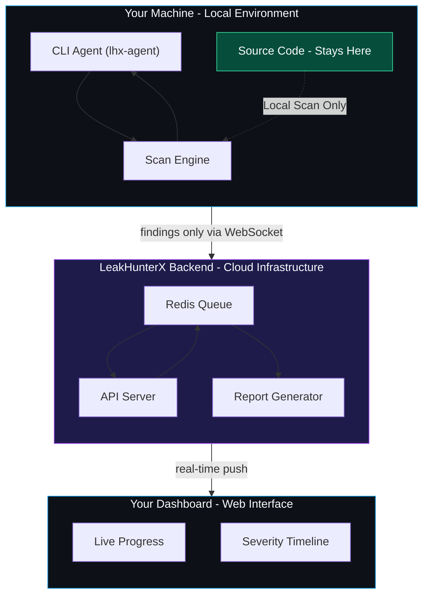

# LeakHunterX Agent (`lhx-agent`)

[](https://github.com/Omkar443/leakhunterx-agent)
[](https://www.python.org/)
[](LICENSE)
[](https://github.com/Omkar443/leakhunterx-agent)
[]()

Lightweight, high-performance security scanning agent for the **LeakHunterX** SaaS security platform. It performs automated client-side security analysis, endpoint discovery, and secret leak detection locally on your machine—ensuring that **your source code and target scripts never leave your environment**.

---

## 🏗️ System Architecture

LeakHunterX Agent operates on a **privacy-first local execution architecture**. Scanning, parsing, and JavaScript leak detection happen locally within your infrastructure. Only structured finding metadata (with secrets redacted) is streamed back to the cloud backend.

### Architecture Diagram



### ASCII Architecture Overview

```text
┌─────────────────────────────────────────┐               ┌─────────────────────────────────────────┐
│              Your Machine               │               │           LeakHunterX Backend           │
│           (Local Environment)           │               │          (Cloud Infrastructure)         │
│                                         │               │                                         │
│  ┌───────────────────────────────────┐  │               │  ┌───────────────────────────────────┐  │
│  │           >_ CLI Agent            │  │  findings     │  │            Redis Queue            │  │
│  └─────────────────┬─────────────────┘  │  only via     │  └─────────────────┬─────────────────┘  │
│                    │                    │  WebSocket    │                    │                    │
│  ┌─────────────────┴─────────────────┐  ├──────────────>│  ┌─────────────────┴─────────────────┐  │
│  │           Q Scan Engine           │  │               │  │            API Server             │  │
│  └─────────────────┬─────────────────┘  │               │  └─────────────────┬─────────────────┘  │
│                    │                    │               │                    │                    │
│  ┌─────────────────┴─────────────────┐  │               │  ┌─────────────────┴─────────────────┐  │
│  │  <> Source Code (← Stays here)    │  │               │  │          Report Generator         │  │
│  └───────────────────────────────────┘  │               │  └───────────────────────────────────┘  │
└─────────────────────────────────────────┘               └────────────────────┬────────────────────┘
                                                                               │
                                                                        real-time push
                                                                               │
                                                          ┌────────────────────▼────────────────────┐
                                                          │             Your Dashboard              │
                                                          │              (Web Interface)            │
                                                          │                                         │
                                                          │  ┌───────────────────────────────────┐  │
                                                          │  │           ⚡ Live Progress          │  │
                                                          │  ├───────────────────────────────────┤  │
                                                          │  │        ⚠ Severity Timeline        │  │
                                                          │  └───────────────────────────────────┘  │
                                                          └─────────────────────────────────────────┘
```

### Component Breakdown

1. **Local Machine (Your Environment)**
   - **`>_ CLI Agent` (`lhx-agent`)**: Command-line lifecycle runner handling process startup, token pairing, signal handling (`SIGINT`/`SIGTERM`), watchdog timers, and scan resumption.
   - **`Q Scan Engine`**:
     - **Crawler Module (`crawler.py`)**: Asynchronous HTTP crawler discovering HTML entry points, sub-routes, and client-side asset declarations.
     - **Discovery Engine (`discovery.py`)**: Extracts API endpoints, hidden routes, and script dependencies.
     - **JS Leak Detector (`leak_detector.py` & `js_analyzer.py`)**: Analyzes JavaScript AST and regex patterns to identify hardcoded API keys, JWT tokens, AWS credentials, database connection strings, and exposed sensitive endpoints.
     - **Orchestrator & State Manager (`orchestrator.py`, `state_manager.py`)**: Manages scan phases, concurrency, and real-time state persistence (`.lhx_state.json`).
   - **`<> Source Code (← Stays here)`**: **Strict Privacy Guarantee**. All source code parsing and secret detection occurs strictly in-memory on your local device. Source code and raw target files are **never** uploaded.

2. **Secure WebSocket / Telemetry Bridge**
   - **`findings only via WebSocket`**: Streams sanitized finding alerts (severity, category, redacted snippet context) and live progress updates to the cloud backend.

3. **LeakHunterX Backend (Cloud Infrastructure)**
   - **`Redis Queue`**: Asynchronous message broker buffering real-time scan events and agent heartbeats.
   - **`API Server`**: Handles agent authentication (`X-Agent-Secret`), pairs workspace credentials, and coordinates remote scan jobs.
   - **`Report Generator`**: Aggregates findings into compliance summaries, PDF/JSON exportable reports, and vulnerability metrics.

4. **Web Dashboard (User Interface)**
   - **`Live Progress`**: Displays real-time progress indicators, file counts, scan phase status, and active crawler threads.
   - **`Severity Timeline`**: Visual timeline categorizing vulnerabilities by severity (Critical, High, Medium, Low, Info).

---

## ✨ Key Features

- 🔒 **Zero Source Code Exposure**: Target source code and sensitive scripts remain 100% local.
- ⚡ **Real-Time Findings Streaming**: Streams findings directly to your dashboard as soon as they are discovered.
- 🕵️ **Deep JavaScript Leak Detection**: Detects API keys, OAuth tokens, private keys, database URLs, and unlinked API endpoints inside minified JavaScript bundles.
- 🔄 **Resumable Scan Engine**: Stateful checkpointing allows interrupted scans to resume without starting over.
- 💻 **Cross-Platform**: Native support for **Linux**, **macOS**, and **Windows**.
- 🛠️ **Dual Emission Modes**: Supports `stdout` for standalone local terminal outputs and `http` for cloud dashboard synchronization.

---

## 📦 Installation

### Option 1: Automated One-Liner

#### Linux / macOS
```bash
curl -L https://download.leakhunterx.com/install.sh | bash
```

#### Windows (PowerShell)
```powershell
iwr -Uri https://download.leakhunterx.com/install.ps1 -OutFile install.ps1; .\install.ps1
```

---

### Option 2: Manual Installation via Pip

Requirements: **Python >= 3.9**

```bash
# Clone repository
git clone https://github.com/Omkar443/leakhunterx-agent.git
cd leakhunterx-agent

# Install package
pip install .
```

---

### Option 3: Development Setup

```bash
pip install -e .
```

---

## 🔑 Agent Pairing & Setup

Before running scans in Backend/SaaS mode, pair your local agent with your LeakHunterX dashboard account:

1. Obtain a **Pairing Token** from your LeakHunterX Dashboard.
2. Run the pairing command:

```bash
lhx-agent pair <YOUR_PAIRING_TOKEN>
```

If no token is supplied as an argument, the CLI will interactively prompt for it:

```bash
lhx-agent pair
```

### Credentials Storage

After successful pairing, your agent credentials (`agent_id` and `agent_secret`) are saved securely in cross-platform location:

- **Linux**: `~/.leakhunterx/agent_secret.json`
- **macOS**: `~/Library/Application Support/LeakHunterX/agent_secret.json`
- **Windows**: `%APPDATA%\LeakHunterX\agent_secret.json`

---

## 🚀 Usage Guide

### Basic Scan

Run a scan against a target URL:

```bash
lhx-agent run https://example.com
```

### Run Options & Flags

```bash
# Run with debug logging
lhx-agent run https://example.com --log-level DEBUG

# Save logs to file
lhx-agent run https://example.com --log-file scan.log

# Resume an interrupted scan using scan ID
lhx-agent run --resume-scan scan_abc123xyz

# Specify custom emission mode (stdout or http)
lhx-agent --mode http run https://example.com

# Specify operator ID for audit tracking
lhx-agent --operator-id sec-team-member run https://example.com
```

---

## ⚙️ Configuration & Environment Variables

LeakHunterX Agent can be configured via environment variables or a `.env` file:

| Environment Variable | Default Value | Description |
| :--- | :--- | :--- |
| `BACKEND_URL` | `https://backend-leakhunterx.onrender.com` | LeakHunterX SaaS backend API endpoint |
| `LOG_LEVEL` | `INFO` | Logging level (`DEBUG`, `INFO`, `WARNING`, `ERROR`, `CRITICAL`) |
| `LOG_FILE` | `None` | Optional path to write file logs |
| `CRAWLER_CONCURRENCY` | `5` | Maximum concurrent crawler workers |
| `CRAWL_TIMEOUT` | `300` | Crawling phase timeout (seconds) |
| `ANALYSIS_TIMEOUT` | `30` | JavaScript analysis phase timeout (seconds) |
| `MAX_PAGES` | `500` | Maximum pages to crawl per scan |
| `MAX_DEPTH` | `3` | Maximum crawl depth |
| `JS_FETCH_TIMEOUT` | `30` | Timeout when fetching JavaScript files (seconds) |
| `MAX_JS_FILE_SIZE` | `15728640` (15MB) | Maximum allowed JS file size for scanning |
| `VERIFY_SSL` | `False` | Enforce SSL certificate verification |
| `HEARTBEAT_INTERVAL` | `60` | Heartbeat ping interval to backend (seconds) |
| `SHUTDOWN_TIMEOUT` | `2` | Timeout for graceful shutdown during cancellation |

---

## 🛑 Exit Codes

The agent uses standardized exit codes for supervisor and script integration:

| Code | Meaning | Action / Description |
| :---: | :--- | :--- |
| `0` | **Success** | Scan or pairing completed successfully |
| `1` | **Error** | Unhandled internal exception or startup failure |
| `2` | **Config Error** | Failed to load environment configuration |
| `3` | **Invalid Argument** | Invalid target URL or missing parameters |
| `4` | **State Mismatch** | Config hash mismatch when attempting to resume a scan |
| `75` | **Revoked Credentials** | Agent token revoked or invalid; re-pairing required (`lhx-agent pair`) |
| `130` | **Interrupted** | Graceful shutdown triggered via Ctrl+C (`SIGINT`/`SIGTERM`) |

---

## 🛡️ Security & Privacy Model

LeakHunterX Agent is designed around **Privacy-by-Design**:

- **No Remote Code Execution**: The agent only performs GET requests for web resource discovery and scanning.
- **Redacted Secret Logging**: Raw secret values are automatically redacted in logs and console output.
- **Local AST Analysis**: JavaScript parsing and secret regex matching occur in-memory locally.
- **Minimal Metadata Transmission**: Only metadata required for vulnerability alerts (vulnerability class, line location, redacted context) is sent over encrypted HTTPS/WSS connections to the LeakHunterX backend.

---

## 🤝 Contributing

Contributions are welcome! Please read [`CONTRIBUTING.md`](CONTRIBUTING.md) for details on submitting pull requests and code guidelines.

---

## 📄 License

This project is licensed under the **MIT License** - see the [`LICENSE`](LICENSE) file for details.
